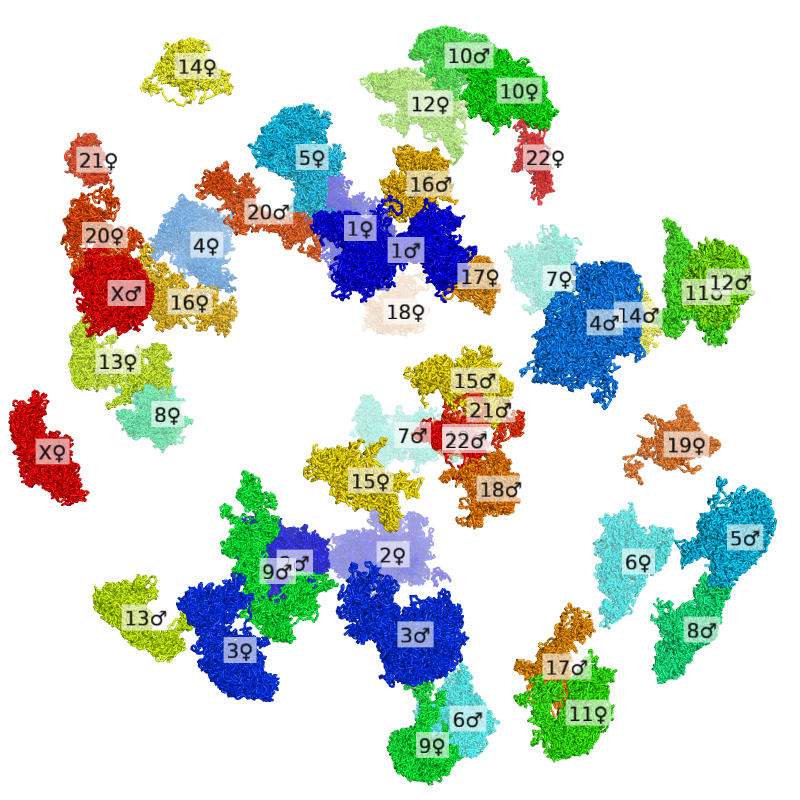
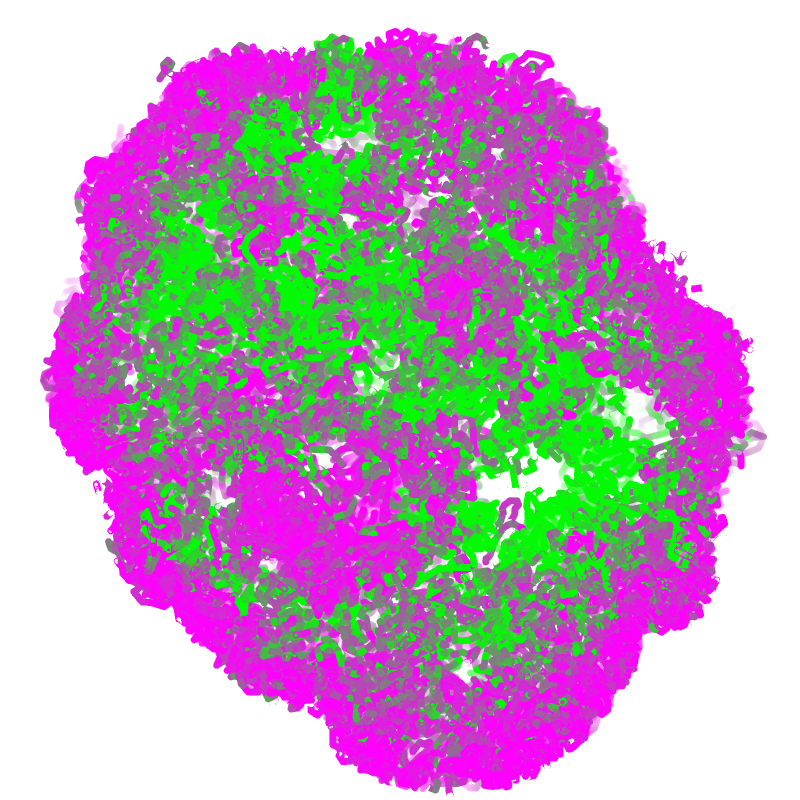
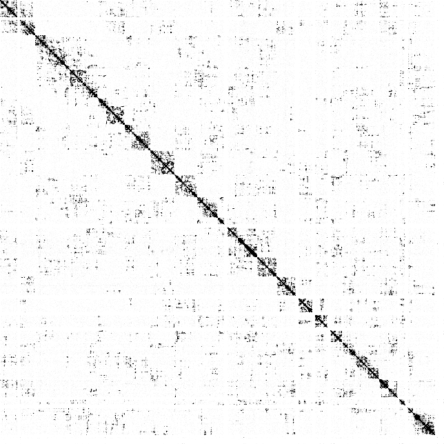
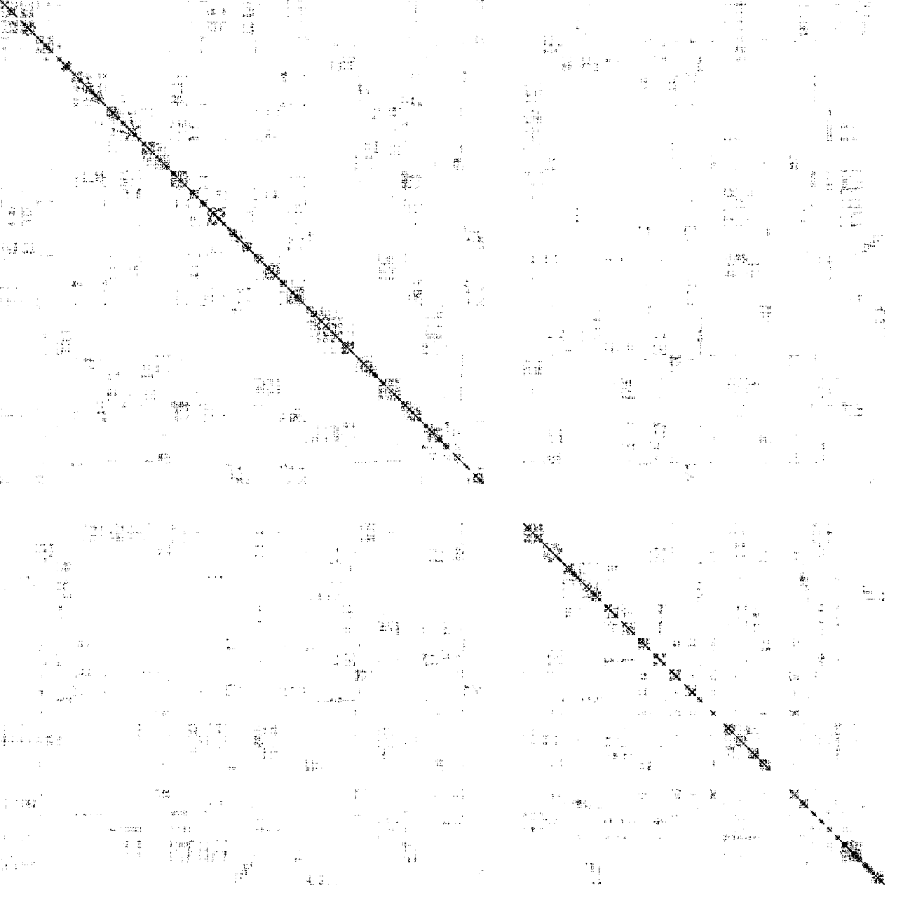

# Dip-C


## Table of Contents

* [Introduction](#intro)
* [Citations](#cite)
  - [Original Paper](#cite_science_2018)
  - [Mouse Eye and Nose](#cite_nsmb_2019)
* [File Formats](#format)
  - [Phased SNPs](#snp)
  - [Read Segments](#seg)
  - [Contact Legs](#leg)
  - [Contacts](#con)
  - [3D Genomes](#3dg)
  - [Genomic Regions](#reg)
* [Requirements](#require)
  - [Basic Requirements](#basic_require)
  - [Additional Requirements](#add_require)
* [Typical Workflow](#workflow)
* [Stand-alone Workflow (Old)](#workflow_old)
* [Interactive Visualization of Contacts](#interact)
* [Interactive Visualization of 3D Genomes](#view3d)
  - [Getting Started: Color by Chromosome](#basic_color_chr)
  - [Expand a Nucleus into Separate Chromosomes](#exp_chr)
  - [Color by CpG Frequency](#color_cpg)
  - [Working with Haploid Cells](#hap_3d)
* [Generation of Contact Matrices](#con_mat)


## <a name="intro"></a>Introduction
**Dip**loid **C**hromatin Conformation Capture (Dip-C) reconstructs 3D diploid genomes from single cells by imputing the two chromosome haplotypes linked by each genomic contact.

An alternative (faster and more careful) implementation of the Dip-C algorithm is included in [hickit](https://github.com/lh3/hickit).

## <a name="cite"></a>Citations
### <a name="cite_science_2018"></a>Original Paper
Please cite the original Dip-C paper, which described the Dip-C method and algorithm. This work studied a human B-lymphoblastoid cell line (LCL; [GM12878](https://www.coriell.org/0/Sections/Search/Sample_Detail.aspx?Ref=GM12878&Product=CC)), peripheral blood mononuclear cells (PBMCs), and mouse embryonic stem cells (mESCs; raw data from a previous [study](https://www.nature.com/articles/nature23001)):

Tan, Longzhi*; Xing, Dong*; Chang, Chi-Han; Li, Heng; Xie, X. Sunney "Three-dimensional genome structures of single diploid human cells," *Science* **43**, 924-928. DOI:10.1126/science.aat5641 (2018).

* [Link](http://science.sciencemag.org/content/361/6405/924)
* Raw data: [SRP149125](https://www.ncbi.nlm.nih.gov/sra/SRP149125)
* Processed data: [GSE117876](https://www.ncbi.nlm.nih.gov/geo/query/acc.cgi?acc=GSE117876)

### <a name="cite_nsmb_2019"></a>Mouse Eye and Nose
Our second Dip-C paper included more detailed experimental protocols, the combined use of [hickit](https://github.com/lh3/hickit) and this repo, and a more convenient (yet less sensitive) version that uses homemade Nextera instead of multiplex end-tagging amplification (META). This work studied the mouse eye and nose during development, with a focus on rod photoceptors and olfactory sensory neurons (OSNs):

Tan, Longzhi*; Xing, Dong*; Daley, Nicholas; Xie, X. Sunney "Three-dimensional genome structures of single sensory neurons in mouse visual and olfactory systems," *Nature Structural & Molecular Biology* **26**, 297-307. DOI:10.1038/s41594-019-0205-2 (2019).

* [Link](https://www.nature.com/articles/s41594-019-0205-2)
* Raw & processed data: [GSE121791](https://www.ncbi.nlm.nih.gov/geo/query/acc.cgi?acc=GSE121791)

## <a name="format"></a>File Formats
### <a name="snp"></a>Phased SNPs
To resolve the two haplotypes, a list of phased single-nucleotide polymorphisms (SNPs) is required in a tab-delimited format (chromosome, coordinate, paternal nucleotide, maternal nucleotide).

An example SNP file for the GM12878 cell line (in hg19 coordinates), based on the 2016-1.0 release of [Illumina Platinum Genomes](https://www.illumina.com/platinumgenomes.html), is provided as `snps/NA12878.txt.gz`. The first few lines are shown below:

```
1	534324	G	T
1	550515	T	C
1	565419	G	C
1	655642	G	A
1	666543	G	A
1	676118	T	C
1	705882	A	G
1	727529	A	G
1	732772	G	A
1	742825	A	G
```

### <a name="seg"></a>Read Segments
The basic output of a chromatin conformation capture (3C/Hi-C) experiment is sequencing reads (or read pairs) containing more than one genomic segments. In each of these reads (sometimes known as *chimeric* reads), genomic segments far away in the linear genome (or even from different chromosomes) are joined by proximity-based ligation.

These segments are recorded in a `.seg` file as an intermediate format. Each line represents a read (or read pair) in a tab-delimited format (read name, segment 1, segment 2 ...).

Each segment is recorded as a comma-delimited string: ``.`` for read 1 and ``m`` (short for "mate") for read 2, start coordinate in the read, end coordinate in the read, chromosome, start coordinate in the genome, end coordinate in the genome, strand of the genome (`+` or `-`), haplotype (`.` for unknown, `0` for paternal, and `1` for maternal). A segment has a known haplotype if it carries one or more phased SNPs.

An example `.seg` (short for "segment") file is:
```
HWI-D00433:595:HLYW7BCXY:1:1209:15116:100489    .,0,211,5,94770308,94770519,+,. m,57,211,5,97167374,97167528,-,0        m,0,61,5,94770541,94770602,-,.
HWI-D00433:595:HLYW7BCXY:1:1113:20520:48210     .,0,193,21,23683758,23683951,-,0        .,188,255,21,25124149,25124216,-,.
HWI-D00433:595:HLYW7BCXY:2:2207:6749:75115      .,39,92,15,71782216,71782269,-,.        .,0,43,15,62676681,62676724,+,.
HWI-D00433:595:HLYW7BCXY:1:1103:9994:47614      .,44,278,1,19116987,19117221,+,.        .,0,48,1,19108099,19108147,-,.
HWI-D00433:595:HLYW7BCXY:2:1216:14071:49584     .,0,114,11,120680807,120680921,+,.      .,109,211,11,120689618,120689720,-,.    m,0,211,11,120689228,120689439,+,.
```

### <a name="leg"></a>Contact Legs
Here I define a "leg" as an endpoint of a read segment, so named because it will form one of the two legs of a chromatin contact. More generally, a leg can be any single point in the genome.

Each leg is recorded as a comma-delimited string: chromosome, coordiante, haplotype.

An example `.leg` file is:
```
1,948359,.
1,1192624,.
1,2561820,.
1,2836242,.
1,2954969,1
1,3114198,.
1,3343831,.
1,3455767,.
1,3518062,.
1,3540154,1
```

### <a name="con"></a>Contacts
Chromatin contacts are a crucial concept in 3C/Hi-C. A contact refers to the proximity-based ligation of two genomic segments far away in the linear genome (or even from different chromosomes). Here I define a contact as the two adjoining endpoints (legs) of two different segments in a same read (or read pair).

Each contact is recorded as a tab-delimited line: leg 1, leg 2.

An example `.con` (short for "contact") file is:
```
1,858641,.      1,861338,.
1,861471,.      1,862872,.
1,918037,.      1,1024147,.
1,918249,1      1,1231502,.
1,921617,0      1,956928,.
1,922873,.      1,926783,.
1,923319,.      1,957711,.
1,946196,.      1,1235547,.
1,948480,.      1,1133615,.
1,959161,.      1,962343,.
```

There are some subtleties in this definition:
* In some studies, contacts are defined only between adjacent segments and therefore corresponds exactly to ligation junctions. When a read (or read pair) contains more than two segments, however, I define contacts between all pairs of segments. This is similar to bulk studies of multi-way contacts.
* The coordinate of a leg is exact (and most likely at a restriction digestion site, for example `GATC`) if it resides in the middle of read 1 or read 2. It is approximate if it resides in the unread gap between read 1 and read 2.
* The two legs of a contact are interchangeable. To avoid ambiguity, I arbitarily impose that leg 1 < leg 2.
* Here directionalities are ignored. In contrast, [hickit](https://github.com/lh3/hickit) preserves this additional information by adopting the [`.pairs` format](https://github.com/4dn-dcic/pairix/blob/master/pairs_format_specification.md) of the 4D Nucleome program as the contact file format.

### <a name="3dg"></a>3D Genomes
The primary output of the Dip-C algorithm is the 3D structure of a single-cell genome. Following the definition in [nuc_dynamics](https://github.com/TheLaueLab/nuc_dynamics), the 3D structure of each chromosome is represented by 3D coordinates of regularly spaced points (0 kb, 10 kb, 20 kb, 30 kb ...) along the chromosome. 3D coordinates of points elsewhere will be linearly interpolated from the given points.

Each 3D genome is recorded in a tab-delimited format (chromosome with `(pat)` for paternal and `(mat)` for maternal, coordinate, x, y, z).

An example `.3dg` (short for "3D genome") file is:
```
1(mat)  1420000 0.791377837067  10.9947291355   -13.1882897693
1(mat)  1440000 -0.268241283699 10.5200875887   -13.0896257278
1(mat)  1460000 -1.3853075236   10.5513787498   -13.1440142173
1(mat)  1480000 -1.55984101733  11.4340829129   -13.6026301209
1(mat)  1500000 -0.770991778399 11.4758488546   -14.5881137222
1(mat)  1520000 -0.0848245107875        12.2624690808   -14.354289628
1(mat)  1540000 -0.458643807046 12.5985791771   -13.4701149287
1(mat)  1560000 -0.810322906201 12.2461643989   -12.3172933413
1(mat)  1580000 -2.08211172035  12.8886838656   -12.8742007778
1(mat)  1600000 -3.52093948201  13.1850935438   -12.4118684428
```

### <a name="reg"></a>Genomic Regions
A `.reg` (short for "region") file performs a similar role to a [BED file](https://genome.ucsc.edu/FAQ/FAQformat.html#format1), but with haplotype information. This format can be used to exclude regions of copy-number (CN) gains or losses of heterozygosity (LOHs) from a `.con` file, to set haplotypes in regions of CN losses in a `.con` file, or to extract regions of interest from a `.3dg` file.

Each region is recorded as a tab-delimited line: chromosome, haplotype, start coordinate (`.` for the start of the chromosome), end coordinate (`.` for the end of the chromosome).

An example `.reg` file is:
```
1	.	.	.
2	1	232800000	.
2	.	238500000	.
4	.	.	.
5	.	165800000	167800000
5	1	167800000	.
6	1	.	.
11	.	.	.
16	.	40000000	.
19	.	.	.
```

## <a name="require"></a>Requirements
### <a name="basic_require"></a>Basic Requirements
Dip-C was tested on Python v2.7.13 (macOS and CentOS), with the following basic requirements:

* NumPy (tested on v1.12.1)
* SciPy (tested on v0.13.3)

### <a name="add_require"></a>Additional Requirements
Some Dip-C commands have additional requirements:

* Read pre-processing for META (not required for Nextera or other whole-genome amplification methods): pre-meta from [pre-pe](https://github.com/lh3/pre-pe), which requires [seqtk](https://github.com/lh3/seqtk) for paired-end reads
* Read alignment: [BWA](https://github.com/lh3/bwa) (tested on v0.7.15), [SAMtools](http://www.htslib.org/download/) (tested on v1.3)
* Contact pre-processing & 3D reconstruction: [hickit](https://github.com/lh3/hickit) (tested on v0.1.1)
* `vis` and other mmCIF scripts: [PDBx Python Parser](http://mmcif.wwpdb.org/docs/sw-examples/python/html/index.html)
* mmCIF viewing: [PyMol](https://pymol.org/2/)
* `align`: [rmsd](https://pypi.org/project/rmsd/)

## <a name="workflow"></a>Typical Workflow
In our latest work, both the main Dip-C algorithm and 3D modeling are now carried out with [hickit](https://github.com/lh3/hickit), a much faster and more careful implementation. Below is a typical workflow of such combined use of [hickit](https://github.com/lh3/hickit) and this repo:

```sh
# align reads
bwa mem -5SP genome.fa R1.fq.gz R2.fq.gz | gzip > aln.sam.gz # for Nextera
#seqtk mergepe R1.fq.gz R2.fq.gz | pre-meta - | bwa mem -5SP -p genome.fa - | gzip > aln.sam.gz # for META

# extract segments
hickit.js sam2seg -v snp.txt.gz aln.sam.gz | hickit.js chronly -y - | gzip > contacts.seg.gz # for female
#hickit.js sam2seg -v snp.txt.gz aln.sam.gz | hickit.js chronly - | hickit.js bedflt par.bed - | gzip > contacts.seg.gz # for male

# resolve haplotypes via imputation
hickit -i contacts.seg.gz -o - | bgzip > contacts.pairs.gz
hickit -i contacts.pairs.gz -u -o - | bgzip > impute.pairs.gz

# generate 3D structures (with 3 replicates)
for rep in `seq 1 3`
do
  hickit -s${rep} -M -i impute.pairs.gz -Sr1m -c1 -r10m -c2 -b4m -b1m -O 1m.${rep}.3dg -b200k -O 200k.${rep}.3dg -D5 -b50k -O 50k.${rep}.3dg -D5 -b20k -O 20k.${rep}.3dg
done

# convert from hickit to dip-c formats, and remove repetitive regions from 3d structures
scripts/hickit_pairs_to_con.sh contacts.pairs.gz
scripts/hickit_impute_pairs_to_con.sh impute.pairs.gz
for rep in `seq 1 3`
do
  scripts/hickit_3dg_to_3dg_rescale_unit.sh 20k.${rep}.3dg
  dip-c clean3 -c impute.con.gz 20k.${rep}.dip-c.3dg > 20k.${rep}.clean.3dg # remove repetitive (contact-less) regions
done

# align replicate structures and calculate RMSD (overall value in .log file)
dip-c align -o aligned.20k. 20k.[1-3].clean.3dg 2> 20k.align.log > 20k.align.color

# convert to juicebox format for interactive viewing
# raw contacts
java -Xmx2g -jar juicer_tools.jar pre -n contacts.pairs.gz contacts.hic mm10
# haplotype-resolved contacts
scripts/con_imputed_to_juicer_pre_short.sh impute.con.gz
java -Xmx2g -jar juicer_tools.jar pre -n impute.juicer.txt.gz impute.hic color/mm10.chr.hom.len

# calculate single-cell chromatin compartment values along the genome
dip-c color2 -b1000000 -H -c color/mm10.cpg.1m.txt -s contacts.con.gz > cpg_b1m.color2 # contact-based
dip-c color -c color/mm10.cpg.20k.txt -s3 20k.1.clean.3dg > cpg_s3.color # 3D-structure-based

# calculate radial positioning
dip-c color -C 20k.1.clean.3dg > C.color

# color by chromosome number and visualize as mmCIF (viewable with pymol)
dip-c color -n color/mm10.chr.txt 20k.1.clean.3dg | dip-c vis -c /dev/stdin 20k.1.clean.3dg > 20k.1.clean.n.cif
```

## <a name="workflow_old"></a>Stand-alone Workflow (Old)
The original workflow, which was before the development of [hickit](https://github.com/lh3/hickit) and uses a slightly modified version of [nuc_dynamics](https://github.com/TheLaueLab/nuc_dynamics) for 3D modeling, can be found in an archived [document](README_old).

## <a name="interact"></a>Interactive Visualization of Contacts
A simple shell script, `con_to_juicer_pre_short.sh`, converts a `.con` file into the short format input for [Juicer Tools Pre](https://github.com/theaidenlab/juicer/wiki/Pre) and, subsequently, into a `.hic` file:

```sh
con_to_juicer_pre_short.sh dedup.con.gz # which generates dedup.juicer.txt.gz
java -Xmx2g -jar juicer_tools.jar pre -n dedup.juicer.txt.gz dedup.hic hg19
```

Alternatively, another shell script, `con_imputed_to_juicer_pre_short.sh`, works on an imputed (haplotype-resolved) `.con` file:

```sh
con_imputed_to_juicer_pre_short.sh impute3.round4.con.gz # which generates impute3.round4.juicer.txt.gz
java -Xmx2g -jar juicer_tools.jar pre -n impute3.round4.juicer.txt.gz impute3.round4.hic color/hg19.chr.hom.len
```

The output `.hic` file can then be viewed interactively in [Juicebox](http://www.aidenlab.org/juicebox/) (the error message about the lack of normalization can be ignored).

Below is the visualization of an example `.con` file:


Below is the visualization of an example imputed `.con` file:


## <a name="view3d"></a>Interactive Visualization of 3D Genomes
### <a name="basic_color_chr"></a>Getting Started: Color by Chromosome
We will get started with a simple example: visualize a single cell colored by chromosome (rainbow with blue = chromosome 1 and red = chromosome X/Y).

Before viewing, the following line must be added to the start-up script (`.pymolrc`) of PyMol. Otherwise, PyMol may create bonds between numerous pairs of particles, consuming a large amount of CPU and memory.
```python
set connect_mode, 4
```

First, the `.3dg` file is colored by chromosome with `dip-c color -n` and converted into a `.cif` file with `dip-c vis`, which takes a minute:

```sh
dip-c color -n color/hg19.chr.txt cell.3dg | dip-c vis -c /dev/stdin cell.3dg > cell.n.cif
```

The resulting file, `cell.n.cif`, can now be dragged into an opened PyMol window, and styled as follows:

```python
viewport 800, 800
set ray_shadows,0
as sticks, all
set_bond stick_radius, 0.5, all
spectrum b, rainbow, all, 1, 23
```

The image can be stored as a `.png` file by running:

```python
png cell.n.png, 800, 800, ray=1
```

Below is the final image:


### <a name="exp_chr"></a>Expand a Nucleus into Separate Chromosomes
Sometimes it is desirable to move chromosomes apart, and in some cases to label each one, for better visualization. Chromosomes can be moved apart with `dip-c exp`:

```sh
dip-c exp cell.3dg > cell.exp.3dg 2> cell.exp.py
```

The main output file, `cell.exp.3dg`, can now be colored and converted:

```sh
dip-c color -n color/hg19.chr.txt cell.exp.3dg | dip-c vis -c /dev/stdin cell.exp.3dg > cell.exp.n.cif
```

In PyMol, this `.cif` can be styled and printed in the same way as above. Below is the image:


A movie of rotating the nucleus and moving the chromosomes apart, if desired, can be generated by replacing part of `pymol/pymol_movie_exp.py` with the corresponding part of the secondary output file of `dip-c exp`, `cell.exp.py`. In particular, after running the PyMol scripts, we can go to the menu option File -> Export Movie As -> MPEG..., and select "Ray (slow)", "ffmpeg" as the encoder, and "MPEG 4".

An example movie, generated from [this file](ftp://ftp.ncbi.nlm.nih.gov/geo/samples/GSM3271nnn/GSM3271352/suppl/GSM3271352_gm12878_06.impute3.round4.clean.3dg.txt.gz
) in the GEO database with `pymol/pymol_movie_exp.py`, can be found in [this tweet](https://twitter.com/tanlongzhi/status/1035476482066468864).

To label each chromosome, we first need to store the current camera position in PyMol:

```python
get_view
```

Below is an example printout:

```python
### cut below here and paste into script ###
set_view (\
     0.707233906,    0.091803670,   -0.700993419,\
    -0.206852838,    0.975012839,   -0.081004508,\
     0.676041245,    0.202291712,    0.708551943,\
     0.000000000,    0.000000000, -1053.545166016,\
     0.212142944,    0.067672729,    0.137741089,\
   830.623046875, 1276.467285156,  -20.000000000 )
### cut above here and paste into script ###
```

Going back to the original `.3dg` file, we will shrink each chromosome into a single particle after moving them:

```sh
dip-c exp -c cell.3dg > cell.exp_c.3dg
dip-c vis cell.exp_c.3dg | sed 's/(mat)/♀/g; s/(pat)/♂/g' > cell.exp_c.cif
```

This new `.cif` file can be dragged into another PyMol window and styled with the above `get_view` printout:

```python
viewport 800, 800
set_view (\
     0.707233906,    0.091803670,   -0.700993419,\
    -0.206852838,    0.975012839,   -0.081004508,\
     0.676041245,    0.202291712,    0.708551943,\
     0.000000000,    0.000000000, -1053.545166016,\
     0.212142944,    0.067672729,    0.137741089,\
   830.623046875, 1276.467285156,  -20.000000000 )
set ray_shadows,0
hide all
label all, chain
set label_size, 10
set label_bg_color, white
set label_bg_transparency, 0.4
png cell.exp.label.png, 800, 800, ray=1
```

The output image can then be overlaid onto the previous image to label each chromosome. Below is the final overlay:



### <a name="color_cpg"></a>Color by CpG Frequency
We begin by calculating the CpG frequency of each 20 kb bin along the human genome with `cpg.sh`, which requires [bedtools](https://bedtools.readthedocs.io/en/latest/) and takes a while:

```sh
cpg.sh genome.fa 20000 > hg19.cpg.20k.txt
```

Some precomputed files are provided. For example, the first few lines of `color/hg19.cpg.20k.txt` are:

```
1	20000	0.0279
1	40000	0.0082
1	60000	0.00725
1	80000	0.00715
1	100000	0.0072
1	120000	0.00585
1	140000	0.01945
1	160000	0.00995
1	180000	0.0138889
1	220000	0.0162602
```

This file can then be used to color a cell with `dip-c color -c`:

```sh
dip-c color -c color/hg19.cpg.20k.txt cell.3dg | dip-c vis -M -c /dev/stdin cell.3dg > cell.cpg.cif
```

The resulting `.cif` file can be styled in PyMol to show a single slice, whose coloring requires the [spectrumany](https://pymolwiki.org/index.php/Spectrumany) plugin:

```python
viewport 800, 800
clip slab, 10
set ray_shadows,0
set ambient, 1
set specular, off
set ray_opaque_background, off
as sticks, all
set_bond stick_radius, 0.5, all
spectrumany b, magenta green, all, 0.005, 0.02
png cell.cpg.png, 800, 800, ray=1
```

Note that the cell can be serially sliced by moving the clipping planes:

```python
clip move, 15
```

Below is an example image:



### <a name="hap_3d"></a>Working with Haploid Cells

Although originally designed for diploid cells, Dip-C can also handle haploid cells with minor modifications. Specifically, a haploid `.3dg` file (for example, generated by [hickit](https://github.com/lh3/hickit)) will have chromosome names such as `1` instead of `1(mat)` and `1(pat)`. To visualize such file, a dummy haplotype (such as `(mat)`) must be appended to all chromosome names.

Note that for commonly used haploid mouse embryonic stem cells (mESCs), this dummy value `(mat)` is in fact accurate, because they are typically generated from oocytes. In contrast, this dummy value is only a placeholder for other haploid cells such as the human eHAP cell line.

## <a name="con_mat"></a>Generation of Contact Matrices

In some cases, it might be desirable to convert a `.con` file into a genome-wide contact matrix. This can be achieved with `dip-c bincon`. For example, the code below generates a matrix with 5-Mb bins:

```sh
dip-c bincon -b 5000000 -H -l color/hg19.chr.len dedup.con.gz > dedup.bincon.txt
dip-c bincon -i -b 5000000 -H -l color/hg19.chr.len . > dedup.bincon.info
```

The primary output file, `dedup.bincon.txt`, contains the contact matrix:



The secondary output file, `dedup.bincon.info`, contains the genomic cooridinates of all bin centers. The first few lines are:

```
1	0
1	5000000
1	10000000
1	15000000
1	20000000
1	25000000
1	30000000
1	35000000
1	40000000
1	45000000
```

Similarly, an imputed (haplotype-resolved) `.con` file can be converted to a contact matrix with the following code:

```sh
dip-c bincon -b 5000000 -l color/hg19.chr.len impute3.round4.con.gz > impute3.round4.bincon.txt
dip-c bincon -i -b 5000000 -l color/hg19.chr.len . > impute3.round4.bincon.info
```

The primary output file contains the contact matrix:



The first few lines of the secondary output file are:

```
1(pat)	0
1(pat)	5000000
1(pat)	10000000
1(pat)	15000000
1(pat)	20000000
1(pat)	25000000
1(pat)	30000000
1(pat)	35000000
1(pat)	40000000
1(pat)	45000000
```
