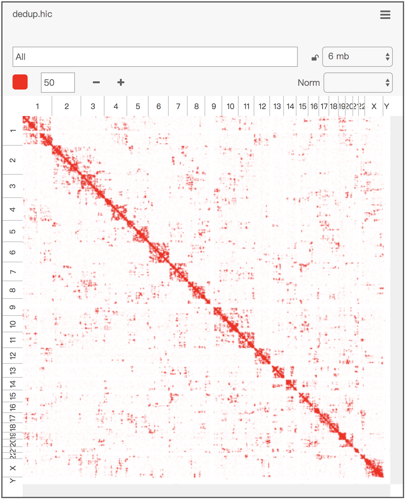
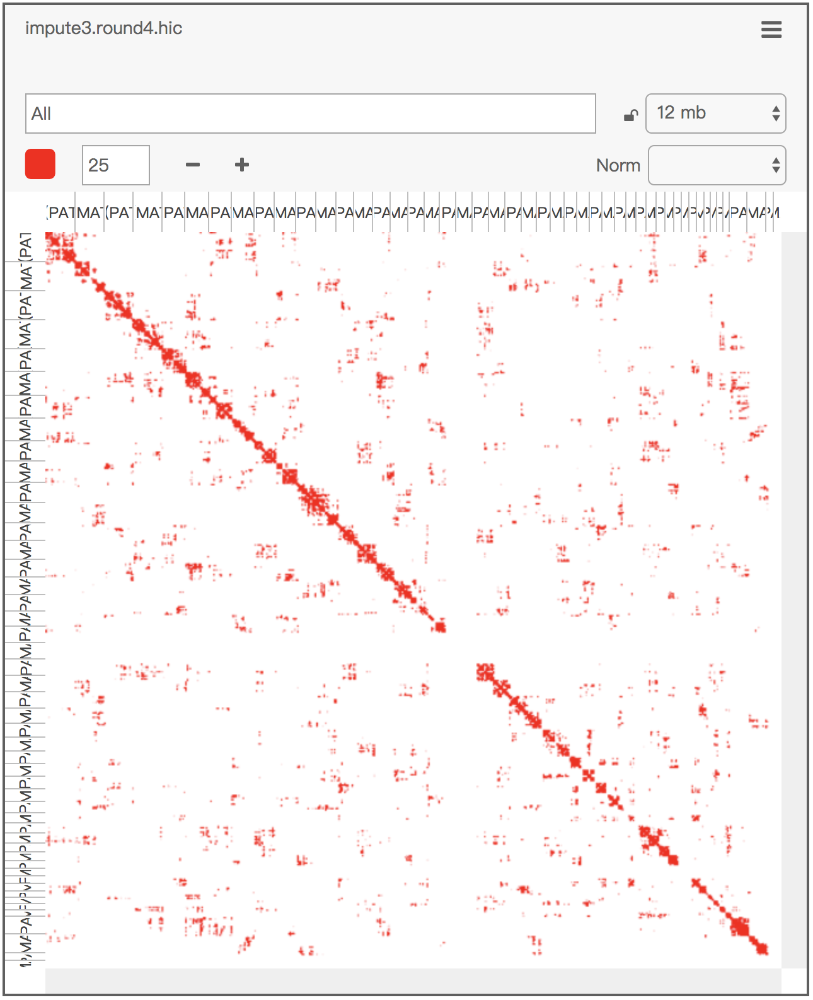
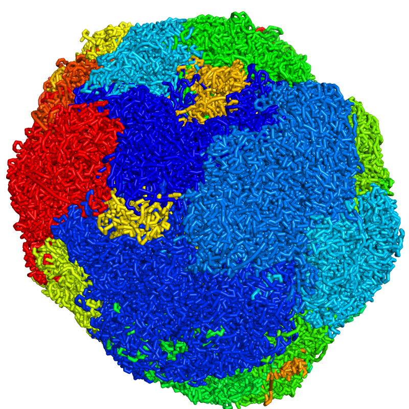
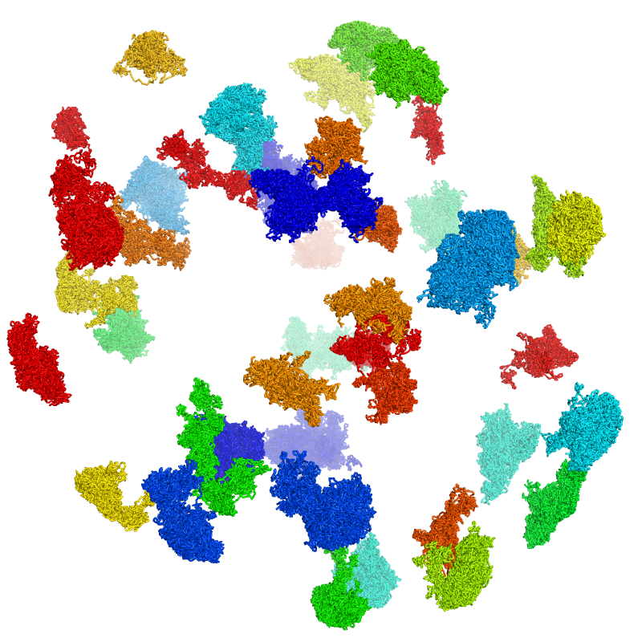

# Dip-C


## Table of Contents

* [Introduction](#intro)
* [Citation](#cite)
* [File Formats](#format)
  - [Phased SNPs](#snp)
  - [Read Segments](#seg)
  - [Contact Legs](#leg)
  - [Contacts](#con)
  - [3D Genomes](#3dg)
  - [Genomic Regions](#reg)
* [Requirements](#require)
  - [Basic Requirements](#basic_require)
  - [Additional Requirements](#add_require)
  - [Patching LIANTI](#patch_lianti)
  - [Patching nuc_dynamics](#patch_nuc)
* [Typical Workflow](#workflow)
* [Interactive Visualization of Contacts](#interact)
* [Interactive Visualization of 3D Genomes](#view3d)
  - [Getting Started: Color by Chromosome](#basic_color_chr)
  - [Expand a Nucleus into Separate Chromosomes](#exp_chr)
  - [Color by CpG Frequency](#color_cpg)

## <a name="intro"></a>Introduction
**Dip**loid **C**hromatin Conformation Capture (Dip-C) reconstructs 3D diploid genomes from single cells by imputing the two chromosome haplotypes linked by each genomic contact.

An alternative (faster and more careful) implementation of the Dip-C algorithm is included in [hickit](https://github.com/lh3/hickit).

## <a name="cite"></a>Citation
Tan, Longzhi; Xing, Dong; Chang, Chi-Han; Li, Heng; Xie, X. Sunney "Three-dimensional genome structures of single diploid human cells," *Science* (2018).

* [Link](http://science.sciencemag.org/content/361/6405/924)
* Raw data: [SRP149125](https://www.ncbi.nlm.nih.gov/sra/SRP149125)
* Processed data: [GSE117876](https://www.ncbi.nlm.nih.gov/geo/query/acc.cgi?acc=GSE117876)

## <a name="format"></a>File Formats
### <a name="snp"></a>Phased SNPs
To resolve the two haplotypes, a list of phased single-nucleotide polymorphisms (SNPs) is required in a tab-delimited format (chromosome, coordinate, paternal nucleotide, maternal nucleotide).

An example SNP file for the GM12878 cell line (in hg19 coordinates), based on the 2016-1.0 release of [Illumina Platinum Genomes](https://www.illumina.com/platinumgenomes.html), is provided as `snps/NA12878.txt.gz`. The first few lines are shown below:

```
1	534324	G	T
1	550515	T	C
1	565419	G	C
1	655642	G	A
1	666543	G	A
1	676118	T	C
1	705882	A	G
1	727529	A	G
1	732772	G	A
1	742825	A	G
```

### <a name="seg"></a>Read Segments
The basic output of a chromatin conformation capture (3C/Hi-C) experiment is sequencing reads (or read pairs) containing more than one genomic segments. In each of these reads (sometimes known as *chimeric* reads), genomic segments far away in the linear genome (or even from different chromosomes) are joined by proximity-based ligation.

These segments are recorded in a `.seg` file as an intermediate format. Each line represents a read (or read pair) in a tab-delimited format (read name, segment 1, segment 2 ...).

Each segment is recorded as a comma-delimited string: ``.`` for read 1 and ``m`` (short for "mate") for read 2, start coordinate in the read, end coordinate in the read, chromosome, start coordinate in the genome, end coordinate in the genome, strand of the genome (`+` or `-`), haplotype (`.` for unknown, `0` for paternal, and `1` for maternal). A segment has a known haplotype if it carries one or more phased SNPs.

An example `.seg` (short for "segment") file is:
```
HWI-D00433:595:HLYW7BCXY:1:1209:15116:100489    .,0,211,5,94770308,94770519,+,. m,57,211,5,97167374,97167528,-,0        m,0,61,5,94770541,94770602,-,.
HWI-D00433:595:HLYW7BCXY:1:1113:20520:48210     .,0,193,21,23683758,23683951,-,0        .,188,255,21,25124149,25124216,-,.
HWI-D00433:595:HLYW7BCXY:2:2207:6749:75115      .,39,92,15,71782216,71782269,-,.        .,0,43,15,62676681,62676724,+,.
HWI-D00433:595:HLYW7BCXY:1:1103:9994:47614      .,44,278,1,19116987,19117221,+,.        .,0,48,1,19108099,19108147,-,.
HWI-D00433:595:HLYW7BCXY:2:1216:14071:49584     .,0,114,11,120680807,120680921,+,.      .,109,211,11,120689618,120689720,-,.    m,0,211,11,120689228,120689439,+,.
```

### <a name="leg"></a>Contact Legs
Here I define a "leg" as an endpoint of a read segment, so named because it will form one of the two legs of a chromatin contact. More generally, a leg can be any single point in the genome.

Each leg is recorded as a comma-delimited string: chromosome, coordiante, haplotype.

An example `.leg` file is:
```
1,948359,.
1,1192624,.
1,2561820,.
1,2836242,.
1,2954969,1
1,3114198,.
1,3343831,.
1,3455767,.
1,3518062,.
1,3540154,1
```

### <a name="con"></a>Contacts
Chromatin contacts are a crucial concept in 3C/Hi-C. A contact refers to the proximity-based ligation of two genomic segments far away in the linear genome (or even from different chromosomes). Here I define a contact as the two adjoining endpoints (legs) of two different segments in a same read (or read pair).

Each contact is recorded as a tab-delimited line: leg 1, leg 2.

An example `.con` (short for "contact") file is:
```
1,858641,.      1,861338,.
1,861471,.      1,862872,.
1,918037,.      1,1024147,.
1,918249,1      1,1231502,.
1,921617,0      1,956928,.
1,922873,.      1,926783,.
1,923319,.      1,957711,.
1,946196,.      1,1235547,.
1,948480,.      1,1133615,.
1,959161,.      1,962343,.
```

There are some subtleties in this definition:
* In some studies, contacts are defined only between adjacent segments and therefore corresponds exactly to ligation junctions. When a read (or read pair) contains more than two segments, however, I define contacts between all pairs of segments. This is similar to bulk studies of multi-way contacts.
* The coordinate of a leg is exact (and most likely at a restriction digestion site, for example `GATC`) if it resides in the middle of read 1 or read 2. It is approximate if it resides in the unread gap between read 1 and read 2.
* The two legs of a contact are interchangeable. To avoid ambiguity, I arbitarily impose that leg 1 < leg 2.
* Here directionalities are ignored. In contrast, [hickit](https://github.com/lh3/hickit) preserves this additional information by adopting the [`.pairs` format](https://github.com/4dn-dcic/pairix/blob/master/pairs_format_specification.md) of the 4D Nucleome program as the contact file format.

### <a name="3dg"></a>3D Genomes
The primary output of the Dip-C algorithm is the 3D structure of a single-cell genome. Following the definition in [nuc_dynamics](https://github.com/TheLaueLab/nuc_dynamics), the 3D structure of each chromosome is represented by 3D coordinates of regularly spaced points (0 kb, 10 kb, 20 kb, 30 kb ...) along the chromosome. 3D coordinates of points elsewhere will be linearly interpolated from the given points.

Each 3D genome is recorded in a tab-delimited format (chromosome with `(pat)` for paternal and `(mat)` for maternal, coordinate, x, y, z).

An example `.3dg` (short for "3D genome") file is:
```
1(mat)  1420000 0.791377837067  10.9947291355   -13.1882897693
1(mat)  1440000 -0.268241283699 10.5200875887   -13.0896257278
1(mat)  1460000 -1.3853075236   10.5513787498   -13.1440142173
1(mat)  1480000 -1.55984101733  11.4340829129   -13.6026301209
1(mat)  1500000 -0.770991778399 11.4758488546   -14.5881137222
1(mat)  1520000 -0.0848245107875        12.2624690808   -14.354289628
1(mat)  1540000 -0.458643807046 12.5985791771   -13.4701149287
1(mat)  1560000 -0.810322906201 12.2461643989   -12.3172933413
1(mat)  1580000 -2.08211172035  12.8886838656   -12.8742007778
1(mat)  1600000 -3.52093948201  13.1850935438   -12.4118684428
```

### <a name="reg"></a>Genomic Regions
A `.reg` (short for "region") file performs a similar role to a [BED file](https://genome.ucsc.edu/FAQ/FAQformat.html#format1), but with haplotype information. This format can be used to exclude regions of copy-number (CN) gains or losses of heterozygosity (LOHs) from a `.con` file, to set haplotypes in regions of CN losses in a `.con` file, or to extract regions of interest from a `.3dg` file.

Each region is recorded as a tab-delimited line: chromosome, haplotype, start coordinate (`.` for the start of the chromosome), end coordinate (`.` for the end of the chromosome).

An example `.reg` file is:
```
1	.	.	.
2	1	232800000	.
2	.	238500000	.
4	.	.	.
5	.	165800000	167800000
5	1	167800000	.
6	1	.	.
11	.	.	.
16	.	40000000	.
19	.	.	.
```

## <a name="require"></a>Requirements
### <a name="basic_require"></a>Basic Requirements
Dip-C was tested on Python v2.7.13 (macOS and CentOS), with the following basic requirements:

* NumPy (tested on v1.12.1)
* SciPy (tested on v0.13.3)

### <a name="add_require"></a>Additional Requirements
Some Dip-C commands have additional requirements:

* Read preprocessing for META: [LIANTI](https://github.com/lh3/lianti) (patch needed), which requires [seqtk](https://github.com/lh3/seqtk) for paired-end reads
* Read alignment: [BWA](https://github.com/lh3/bwa) (tested on v0.7.15), [SAMtools](http://www.htslib.org/download/) (tested on v1.3), and [Sambamba](https://github.com/biod/sambamba/releases) (tested on v0.6.3)
* `seg`: pysam (tested on v0.11.1)
* 3D reconstruction: [nuc_dynamics](https://github.com/TheLaueLab/nuc_dynamics) (patch needed)
* `vis` and other mmCIF scripts: [PDBx Python Parser](http://mmcif.wwpdb.org/docs/sw-examples/python/html/index.html)
* mmCIF viewing: [PyMol](https://pymol.org/2/)

### <a name="patch_lianti"></a>Patching LIANTI
For META read preprocessing, [LIANTI](https://github.com/lh3/lianti) needs a patch to replace the LIANTI adapters with the META ones:

1. Download the [LIANTI](https://github.com/lh3/lianti) source code.
2. Replace LIANTI's `trim.c` with Dip-C's `patch/trim.c`.
3. Compile LIANTI.

### <a name="patch_nuc"></a>Patching nuc_dynamics
For 3D reconstruction, [nuc_dynamics](https://github.com/TheLaueLab/nuc_dynamics) needs a patch to (1) change the backbone energy function, (2) skip the removal of isolated contacts, and (3) output in the 3D Genome (3DG) format instead of the original PDB format (which has a 99,999-atom limit):

1. Download the [nuc_dynamics](https://github.com/TheLaueLab/nuc_dynamics) source code.
2. Replace nuc_dynamics' `nuc_dynamics.py` with Dip-C's `patch/nuc_dynamics.py`.
3. Compile nuc_dynamics.

The above was tested in [May 2017](https://github.com/TheLaueLab/nuc_dynamics/commit/55148e68b919a59c2354d9157131f729495424c9). In Jun 2017, nuc_dynamics also changed its output format, along with other improvements. We have yet to update our patch.

## <a name="workflow"></a>Typical Workflow
Below is a typical workflow starting from paired-end META data (FASTQ), part of which is also included in `dip-c.sh`:

```sh
# read preprocessing and alignment
seqtk mergepe R1.fq.gz R2.fq.gz | lianti trim - | bwa mem -Cp hs37m.fa - | samtools view -uS | sambamba sort -o aln.bam /dev/stdin

# identify genomic contacts
dip-c seg -v snp.txt.gz aln.bam | gzip -c > phased.seg.gz
dip-c con phased.seg.gz | gzip -c > raw.con.gz
dip-c dedup raw.con.gz | gzip -c > dedup.con.gz
dip-c reg -p hf dedup.con.gz | gzip -c > reg.con.gz
dip-c clean reg.con.gz | gzip -c > clean.con.gz

# initial imputation of haplotypes
dip-c impute clean.con.gz | gzip -c > impute.con.gz

# further imputation and 3d reconstruction 
con_to_ncc.sh impute.con.gz
nuc_dynamics.sh impute.ncc 0.1
dip-c impute3 -3 impute.3dg clean.con.gz | gzip -c > impute3.round1.con.gz
dip-c clean3 -c impute.con.gz impute.3dg > impute.clean.3dg

con_to_ncc.sh impute3.round1.con.gz
nuc_dynamics.sh impute3.round1.ncc 0.1
dip-c impute3 -3 impute3.round1.3dg clean.con.gz | gzip -c > impute3.round2.con.gz
dip-c clean3 -c impute3.round1.con.gz impute3.round1.3dg > impute3.round1.clean.3dg

con_to_ncc.sh impute3.round2.con.gz
nuc_dynamics.sh impute3.round2.ncc 0.1
dip-c impute3 -3 impute3.round2.3dg clean.con.gz | gzip -c > impute3.round3.con.gz
dip-c clean3 -c impute3.round2.con.gz impute3.round2.3dg > impute3.round2.clean.3dg

con_to_ncc.sh impute3.round3.con.gz
nuc_dynamics.sh impute3.round3.ncc 0.02
dip-c impute3 -3 impute3.round3.3dg clean.con.gz | gzip -c > impute3.round4.con.gz
dip-c clean3 -c impute3.round3.con.gz impute3.round3.3dg > impute3.round3.clean.3dg

con_to_ncc.sh impute3.round4.con.gz
nuc_dynamics.sh impute3.round4.ncc 0.02
dip-c clean3 -c impute3.round4.con.gz impute3.round4.3dg > impute3.round4.clean.3dg

# color by chromosome number and visualize as mmCIF
dip-c color -n color/hg19.chr.txt impute3.round4.clean.3dg | dip-c vis -c /dev/stdin impute3.round4.clean.3dg > impute3.round4.clean.n.cif
```

## <a name="interact"></a>Interactive Visualization of Contacts
A simple shell script, `con_to_juicer_pre_short.sh`, converts a `.con` file into the short format input for [Juicer Tools Pre](https://github.com/theaidenlab/juicer/wiki/Pre) and, subsequently, into a `.hic` file:

```sh
con_to_juicer_pre_short.sh dedup.con.gz # which generates dedup.juicer.txt.gz
java -Xmx2g -jar juicer_tools.jar pre -n dedup.juicer.txt.gz dedup.hic hg19
```

Alternatively, another shell script, `con_imputed_to_juicer_pre_short.sh`, works on an imputed (haplotype-resolved) `.con` file:

```sh
con_imputed_to_juicer_pre_short.sh impute3.round4.con.gz # which generates impute3.round4.juicer.txt.gz
java -Xmx2g -jar juicer_tools.jar pre -n impute3.round4.juicer.txt.gz impute3.round4.hic color/hg19.chr.hom.len
```

The output `.hic` file can then be viewed interactively in [Juicebox](http://www.aidenlab.org/juicebox/) (the error message about the lack of normalization can be ignored).

Below is the visualization of an example `.con` file:



Below is the visualization of an example imputed `.con` file:



## <a name="view3d"></a>Interactive Visualization of 3D Genomes
### <a name="basic_color_chr"></a>Getting Started: Color by Chromosome
We will get started with a simple example: visualize a single cell colored by chromosome (rainbow with blue = chromosome 1 and red = chromosome X/Y).

Before viewing, the following line must be added to the start-up script (`.pymolrc`) of PyMol. Otherwise, PyMol may create bonds between numerous pairs of particles, consuming a large amount of CPU and memory.
```python
set connect_mode, 4
```

First, the `.3dg` file is colored by chromosome with `dip-c color -n` and converted into a `.cif` file with `dip-c vis`, which takes a minute:

```sh
dip-c color -n color/hg19.chr.txt cell.3dg | dip-c vis -c /dev/stdin cell.3dg > cell.n.cif
```

The resulting file, `cell.n.cif`, can now be dragged into an opened PyMol window, and styled as follows:

```python
viewport 800, 800
set ray_shadows,0
as sticks, all
set_bond stick_radius, 0.5, all
spectrum b, rainbow, all, 1, 20
```

The image can be stored as a `.png` file by running:

```python
png cell.n.png, 800, 800, ray=1
```

Below is the final image:



### <a name="exp_chr"></a>Expand a Nucleus into Separate Chromosomes
Sometimes it is desirable to move chromosomes apart, and in some cases to label each one, for better visualization. Chromosomes can be moved apart with `dip-c exp`:

```sh
dip-c exp cell.3dg > cell.exp.3dg 2> cell.exp.py
```

The additional output file, `cell.exp.py`, contains some PyMol scripts to help generate a movie of slowly moving the chromosomes apart, if needed.

The main output file, `cell.exp.3dg`, can now be colored and converted:

```sh
dip-c color -n color/hg19.chr.txt cell.exp.3dg | dip-c vis -c /dev/stdin cell.exp.3dg > cell.exp.n.cif
```

In PyMol, this `.cif` can be styled and printed in the same way as above. Below is the image:




### <a name="color_cpg"></a>Color by CpG Frequency

