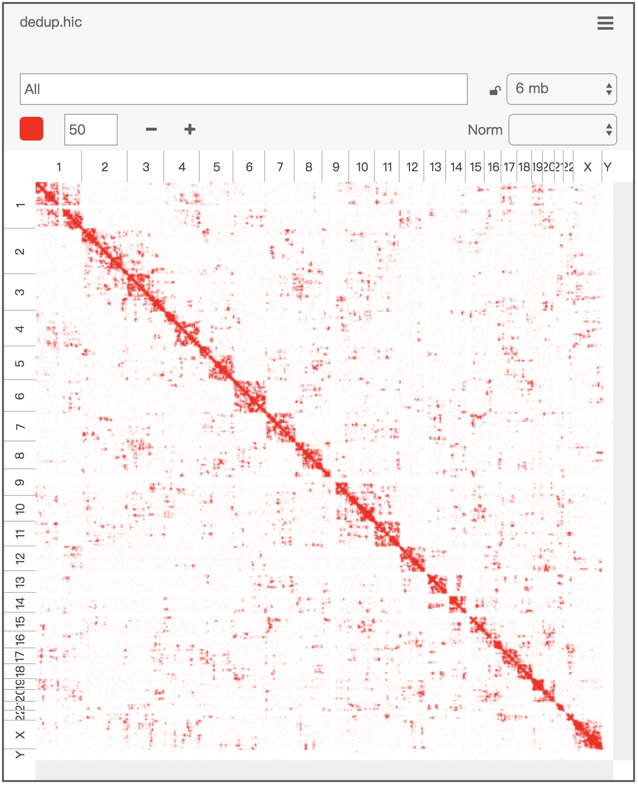
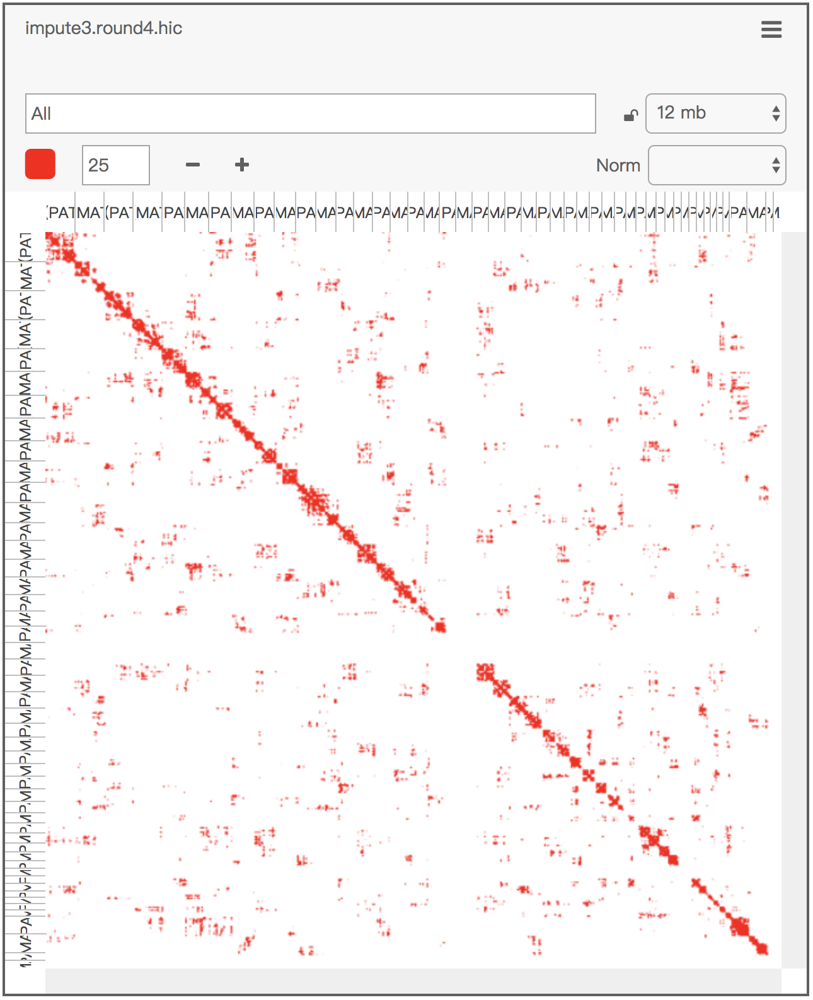
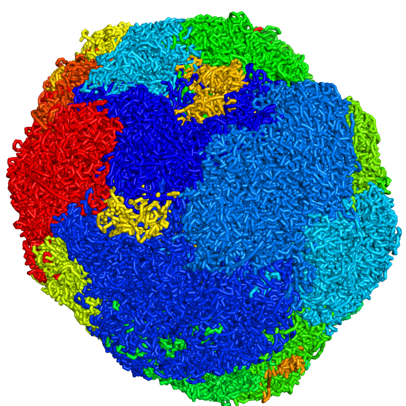
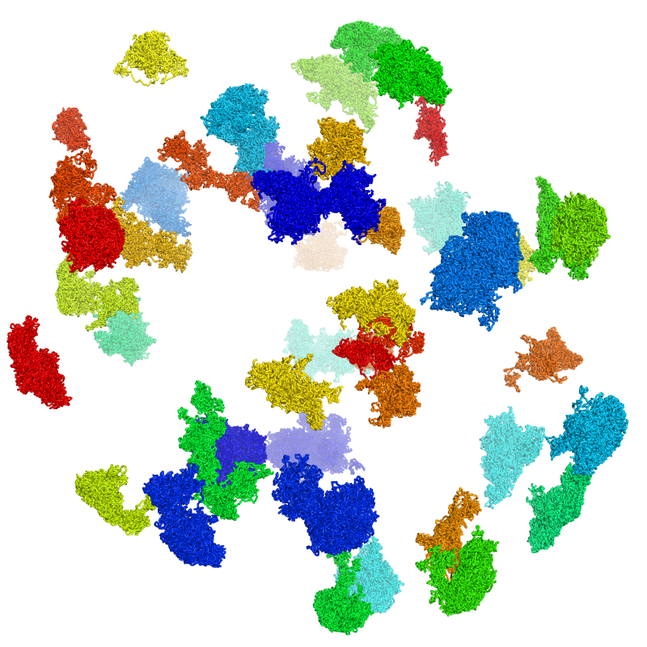
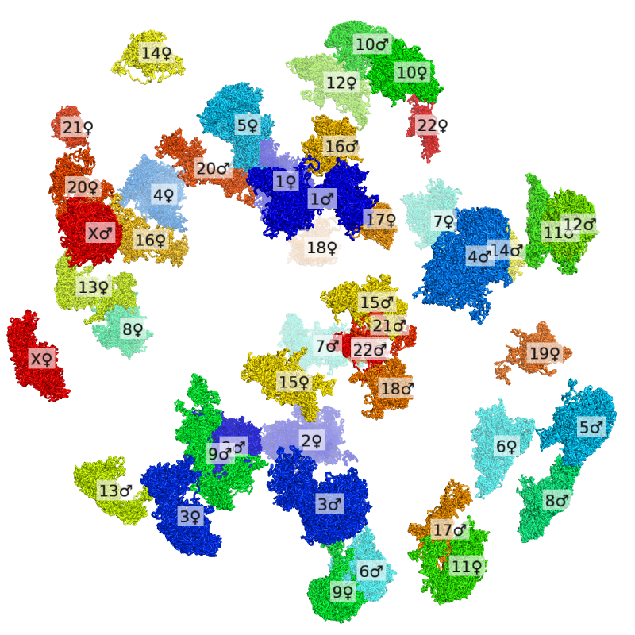
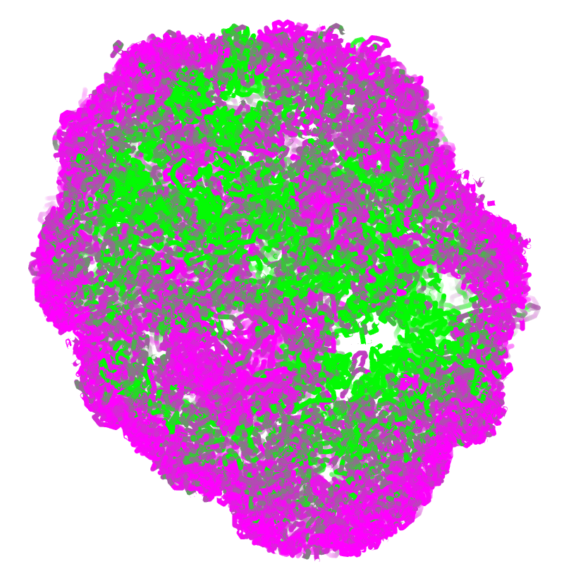
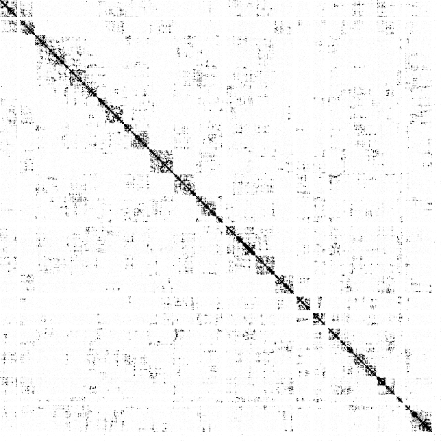
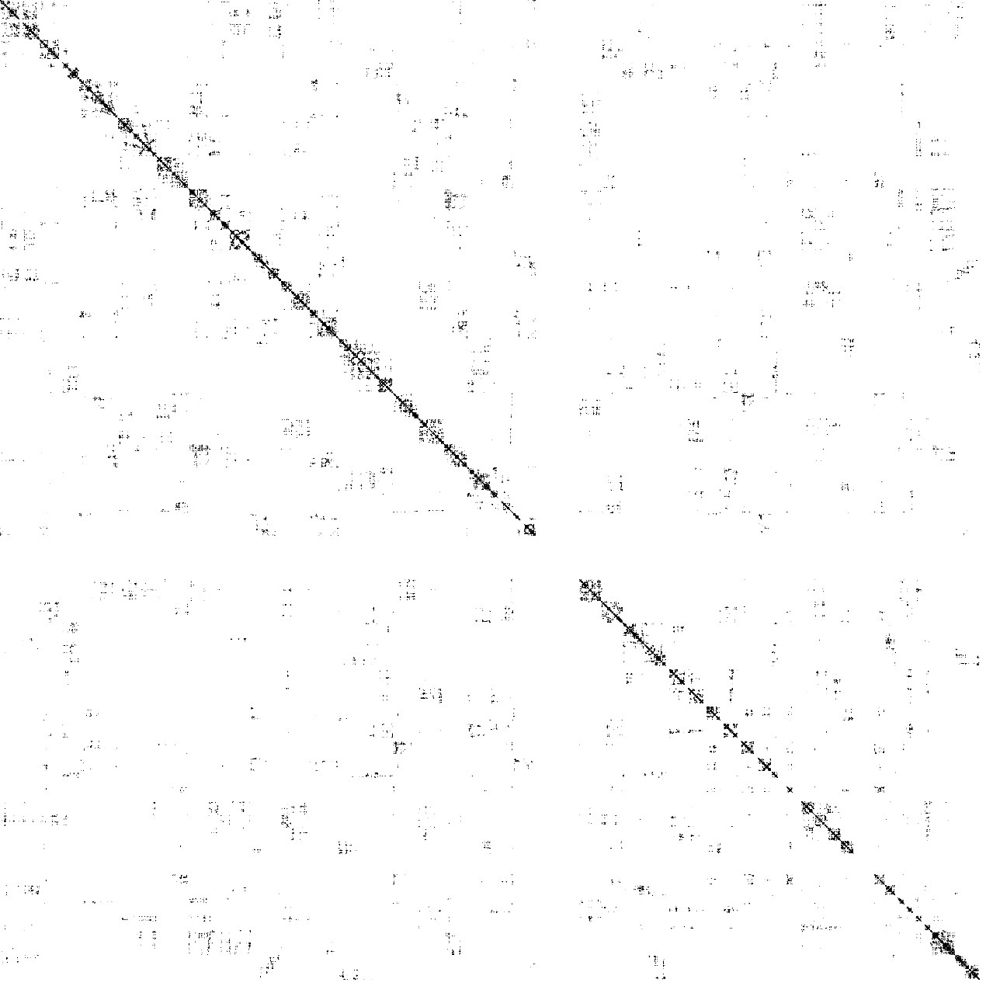

# Visualization

## Interactive Visualization of Contacts

A simple shell script, `con_to_juicer_pre_short.sh`, converts a `.con` file into the short format input for [Juicer Tools Pre](https://github.com/theaidenlab/juicer/wiki/Pre) and, subsequently, into a `.hic` file:

```sh
scripts/con_to_juicer_pre_short.sh dedup.con.gz # which generates dedup.juicer.txt.gz
java -Xmx2g -jar juicer_tools.jar pre -n dedup.juicer.txt.gz dedup.hic hg19
```

Alternatively, another shell script, `con_imputed_to_juicer_pre_short.sh`, works on an imputed (haplotype-resolved) `.con` file:

```sh
scripts/con_imputed_to_juicer_pre_short.sh impute3.round4.con.gz # which generates impute3.round4.juicer.txt.gz
java -Xmx2g -jar juicer_tools.jar pre -n impute3.round4.juicer.txt.gz impute3.round4.hic color/hg19.chr.hom.len
```

The output `.hic` file can then be viewed interactively in [Juicebox](http://www.aidenlab.org/juicebox/) (the error message about the lack of normalization can be ignored).

Below is the visualization of an example `.con` file:

{ width="500" }

Below is the visualization of an example imputed `.con` file:

{ width="500" }

## Interactive Visualization of 3D Genomes

### Getting Started: Color by Chromosome

We will get started with a simple example: visualize a single cell colored by chromosome (rainbow with blue = chromosome 1 and red = chromosome X/Y).

Before viewing, the following line must be added to the start-up script (`.pymolrc`) of PyMol. Otherwise, PyMol may create bonds between numerous pairs of particles, consuming a large amount of CPU and memory.

```python
set connect_mode, 4
```

First, the `.3dg` file is colored by chromosome with `dip-c color -n` and converted into a `.cif` file with `dip-c vis`, which takes a minute:

```sh
dip-c color -n color/hg19.chr.txt cell.3dg | dip-c vis -c /dev/stdin cell.3dg > cell.n.cif
```

The resulting file, `cell.n.cif`, can now be dragged into an opened PyMol window, and styled as follows:

```python
viewport 800, 800
set ray_shadows,0
as sticks, all
set_bond stick_radius, 0.5, all
spectrum b, rainbow, all, 1, 23
```

The image can be stored as a `.png` file by running:

```python
png cell.n.png, 800, 800, ray=1
```

Below is the final image:

{ width="400" }

### Expand a Nucleus into Separate Chromosomes

Sometimes it is desirable to move chromosomes apart, and in some cases to label each one, for better visualization. Chromosomes can be moved apart with `dip-c exp`:

```sh
dip-c exp cell.3dg > cell.exp.3dg 2> cell.exp.py
```

The main output file, `cell.exp.3dg`, can now be colored and converted:

```sh
dip-c color -n color/hg19.chr.txt cell.exp.3dg | dip-c vis -c /dev/stdin cell.exp.3dg > cell.exp.n.cif
```

In PyMol, this `.cif` can be styled and printed in the same way as above. Below is the image:

{ width="400" }

A movie of rotating the nucleus and moving the chromosomes apart, if desired, can be generated by replacing part of `pymol/pymol_movie_exp.py` with the corresponding part of the secondary output file of `dip-c exp`, `cell.exp.py`. In particular, after running the PyMol scripts, we can go to the menu option File -> Export Movie As -> MPEG..., and select "Ray (slow)" (or "Draw (fast)" to save time; difference in video quality is negligible), "ffmpeg" as the encoder, and "MPEG 4".

To label each chromosome, we first need to store the current camera position in PyMol:

```python
get_view
```

Going back to the original `.3dg` file, we will shrink each chromosome into a single particle after moving them:

```sh
dip-c exp -c cell.3dg > cell.exp_c.3dg
dip-c vis cell.exp_c.3dg | sed 's/(mat)/♀/g; s/(pat)/♂/g' > cell.exp_c.cif
```

This new `.cif` file can be dragged into another PyMol window and styled with the saved `get_view` output. The output image can then be overlaid onto the previous image to label each chromosome. Below is the final overlay:

{ width="400" }

### Color by CpG Frequency

We begin by calculating the CpG frequency of each 20 kb bin along the human genome with `cpg.sh`, which requires [bedtools](https://bedtools.readthedocs.io/en/latest/) and takes a while:

```sh
scripts/cpg.sh genome.fa 20000 > hg19.cpg.20k.txt
```

Some precomputed files are provided. For example, the first few lines of `color/hg19.cpg.20k.txt` are:

```
1	20000	0.0279
1	40000	0.0082
1	60000	0.00725
1	80000	0.00715
1	100000	0.0072
1	120000	0.00585
1	140000	0.01945
1	160000	0.00995
1	180000	0.0138889
1	220000	0.0162602
```

This file can then be used to color a cell with `dip-c color -c`:

```sh
dip-c color -c color/hg19.cpg.20k.txt cell.3dg | dip-c vis -M -c /dev/stdin cell.3dg > cell.cpg.cif
```

The resulting `.cif` file can be styled in PyMol to show a single slice, whose coloring requires the [spectrumany](https://pymolwiki.org/index.php/Spectrumany) plugin:

```python
viewport 800, 800
clip slab, 10
set ray_shadows,0
set ambient, 1
set specular, off
set ray_opaque_background, off
as sticks, all
set_bond stick_radius, 0.5, all
spectrumany b, magenta green, all, 0.005, 0.02
png cell.cpg.png, 800, 800, ray=1
```

Note that the cell can be serially sliced by moving the clipping planes:

```python
clip move, 15
```

Below is an example image:

{ width="400" }

### Working with Haploid Cells

Although originally designed for diploid cells, Dip-C can also handle haploid cells with minor modifications. Specifically, a haploid `.3dg` file (for example, generated by [hickit](https://github.com/lh3/hickit)) will have chromosome names such as `1` instead of `1(mat)` and `1(pat)`. To visualize such file, a dummy haplotype (such as `(mat)`) must be appended to all chromosome names.

Note that for commonly used haploid mouse embryonic stem cells (mESCs), this dummy value `(mat)` is in fact accurate, because they are typically generated from oocytes. In contrast, this dummy value is only a placeholder for other haploid cells such as the human eHAP cell line.

## Generation of Contact Matrices

In some cases, it might be desirable to convert a `.con` file into a genome-wide contact matrix. This can be achieved with `dip-c bincon`. For example, the code below generates a matrix with 5-Mb bins:

```sh
dip-c bincon -b 5000000 -H -l color/hg19.chr.len dedup.con.gz > dedup.bincon.txt
dip-c bincon -i -b 5000000 -H -l color/hg19.chr.len . > dedup.bincon.info
```

The primary output file, `dedup.bincon.txt`, contains the contact matrix:

{ width="400" }

The secondary output file, `dedup.bincon.info`, contains the genomic coordinates of all bin centers. The first few lines are:

```
1	0
1	5000000
1	10000000
1	15000000
1	20000000
```

Similarly, an imputed (haplotype-resolved) `.con` file can be converted to a contact matrix:

```sh
dip-c bincon -b 5000000 -l color/hg19.chr.len impute3.round4.con.gz > impute3.round4.bincon.txt
dip-c bincon -i -b 5000000 -l color/hg19.chr.len . > impute3.round4.bincon.info
```

The primary output file contains the contact matrix:

{ width="400" }
